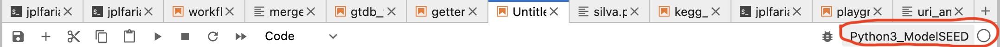
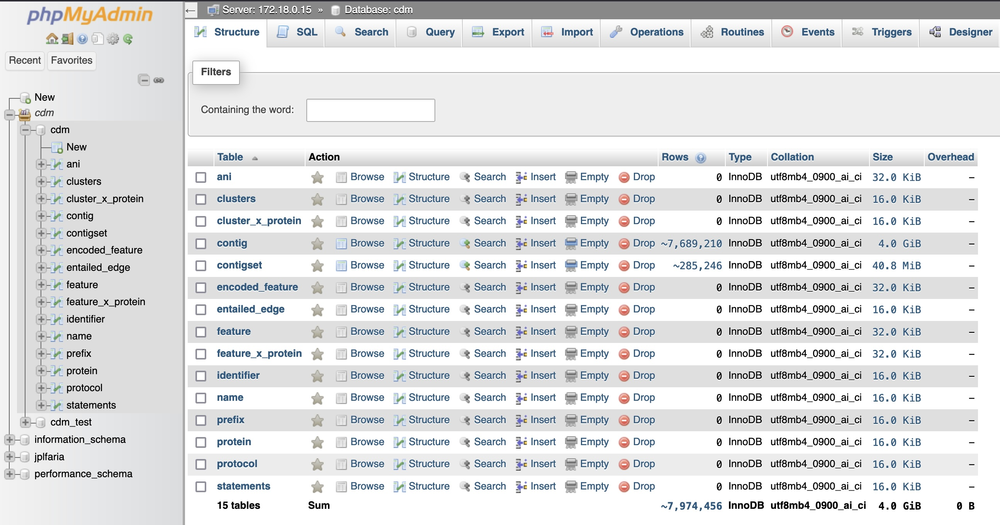

# User Guide: Accessing Sequoia JupyterHub on Sequoia (ANL)

## Step-by-Step Guide

### 1. Set up your ANL CELS account if you don’t already have one:

a) Go to: [CELS Account Management](https://accounts.cels.anl.gov/)

b) Request an account if you don’t have one

c) Here’s what it looks like once you’ve logged in:


d) Once you have an account, log in on the above site and if “HenryLab” is not already listed as a project under your account, use the “Join project” link to join HenryLab

e) Click on “account information” and upload and SSH key. You generate the key on your computer and upload the public key using this interface.
   
### 2. SSH Tunel to the ANL Machine

```<ac.anl_username>```: Your username for SSH access.


```
ssh -A -J <ac.anl_username>login.kbase.us <ac.anl_username>sequoia.mcs.anl.gov
```

or

```
ssh -A -J <ac.anl_username>@logins.cels.anl.gov <ac.anl_username>@sequoia.mcs.anl.gov
```

Or if you want to use a SOCKS proxy

```
ssh -A -J <ac.anl_username>l@ogin.kbase.us -D 1234 <ac.anl_username>@sequoia.mcs.anl.gov
```

or

```
ssh -A -J <ac.anl_username>@logins.cels.anl.gov -D 1234 <ac.anl_username>@sequoia.mcs.anl.gov
```

Additional information on SSH proxys can be found here: https://kbase-jira.atlassian.net/wiki/spaces/PublicOps/pages/1491533825/Configure+FoxyProxy  https://kbase-jira.atlassian.net/wiki/spaces/PublicOps/pages/1411186689/SSH+Proxy+Guides+Kubectl

If you still are having issues after reviewing all information reach out for help in the  ```#sysadmin``` channel on Slack

### 3. Create an Account on Sequoia Jupyter Hub

Contact Filipe either on Slack or via email fliu@anl.gov with your desired username for him to create an account. This username will also be the one used to connect to the DB instances Filipe created.

In addition to the ```cdm``` database available for everyone, when you contact Filipe you can ask him to crerate a sandbox database for you to play. In that case, your username will be the name for that sandbox database, which you can only see and have permission to access.

<b>VERY IMPORTANT<b> - From Filipe you wil receive:
* Temporary password to connect to the JupyterHub
* Temporary password to connect to database instances and the DB UI


 > :x: NEED HELP HERE should we provide instructions on how to change these passwords?

   
### 4. Access JupyterHub:
   
Open a web browser and navigate to the following URL:

```
http://sequoia.mcs.anl.gov:8001
```
Assuming all is properly set up you should see:


This will open the JupyterHub Notebook interface running on the remote server.

You will see many kernels are available we recommend you connect to the "Python3_ModelSEED" one since it has a bunch of libraries you might need already installed.



### 5. Connecting to the cdm database (and other instances like your sandbox):

You can use any database abstraction layer you prefer to connect to the databases, load tables, etc, in this example I will be using SQLAlchemy

```from sqlalchemy import create_engine```

```engine = create_engine("mysql+pymysql://<your_username>:<db_password>@172.18.0.15/<db_name>?charset=utf8mb4")```

* ```<your_username>``` this is the username you asked Filipe for
* ```<db_password>>``` this is the temporary database password you got from Filipe or the one you changed it to
* ```<db_name>``` the DB name you wan to connect to for example ```cdm`` and ```cdm_test``. You can login in the DB UI interface (instructions below to see what databases you have access to)


 > :x: We need to discuss best practices since right now anyone can drop tables and mess up other work, that's why asking Filipe for a sandbox is a good idea. We can implement permission restrictions or manage work between ```cdm``` and ```cdm-test``` but for now be careful!

### 6. Connecting to the DB UI 

Open a web browser and navigate to the following URL:
```
http://sequoia.mcs.anl.gov:8100
```

When prompted to login, username and password are:
* The username you asked Filipe for
* The temporary database password you got from Filipe or the one you changed it to

Once you in you should see something like this:



Explore the interface but a couple of things you might find helpful:
* SQL tab, run SQL queries directly in this interface
* Designer tab, see the ER diagram
